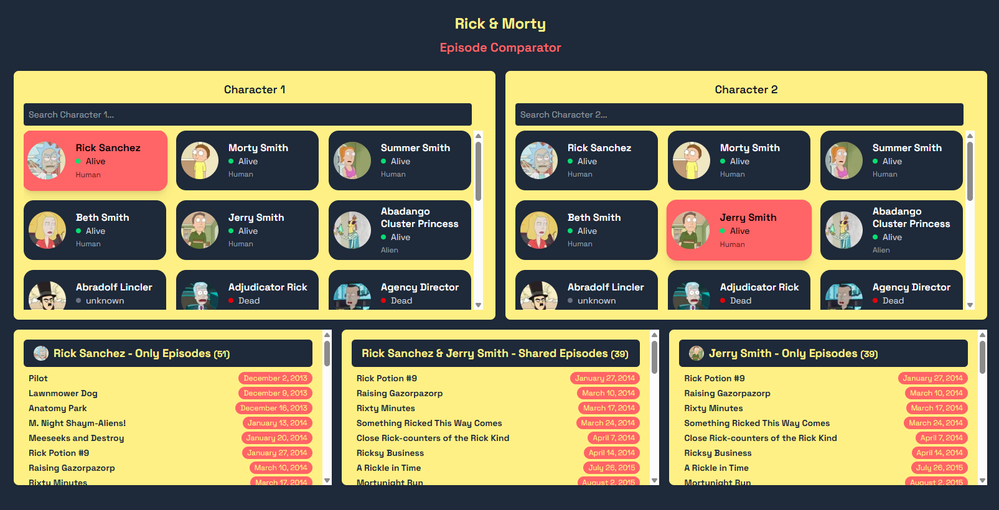

# Rick & Morty Episode Comparator 🧪

A web app that allows users to search, select, and compare episodes between two Rick & Morty characters. Built with **Next.js**, **TypeScript**, and **Tailwind CSS**.



## ✨ Features

- 🔍 Live character search
- 🧑‍🤝‍🧑 Compare any two characters
- 📺 View shared and unique episodes between both
- 🌐 Infinite scroll to load more characters
- ⚡ Responsive design, built with performance in mind
- 🧪 Unit testing with Jest & React Testing Library

---

## 🧰 Tech Stack

| Tool | Description |
|------|-------------|
| [Next.js 15](https://nextjs.org/) | React framework with App Router |
| TypeScript | Static typing |
| Tailwind CSS | Utility-first styling |
| Jest + React Testing Library | Unit testing |
| Rick and Morty API | Data source (REST/GraphQL) |

---

## 🚀 Getting Started

Clone and install dependencies:

```bash
git clone https://github.com/your-username/rick-morty-comparator.git
cd rick-morty-comparator
npm install
npm run dev
Open http://localhost:3000 in your browser.

# Run unit tests
npm test

# Run tests with coverage
npm run test:coverage


## 🗂️ Project Structure

```bash
src/
├─ app/                  # Next.js App Router (Layout, pages)
├─ components/           # UI components (CharacterList, Search, EpisodeSection)
├─ hooks/                # Custom hooks (useCharacterComparison)
├─ services/             # API service
├─ types/                # Type definitions
└─ tests/                # Unit tests

